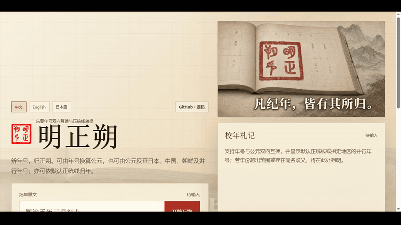

<div align="center">
  
  <h1>明正朔 · Ming Zhengshuo</h1>
  <p><strong>面向历史阅读与 AI Agent 的东亚年号双向互换工具。</strong><br />A bidirectional East Asian era-year tool for historical reading and AI agents.</p>
  <p><a href="https://siyuan-chat.github.io/ming-zhengshuo/"><strong>在线体验</strong></a> · <a href="#安装使用"><strong>安装使用</strong></a> · <a href="#english">English</a> · <a href="#日本語">日本語</a></p>
</div>

```text
唐贞观十九年 → 公元645年 → 日本大化元年
公元1338年 → 日本建武五年／日本北朝历应元年／日本南朝延元三年
```

> 年份级换算；月日原文保留，不作历法转换。

[](docs/promotion/assets/demo.mp4)

### 安装使用

要求 Python 3.10 或更高版本。以下方式从仓库源码安装；本项目尚未据此宣称已发布 PyPI 包。

```bash
git clone https://github.com/Siyuan-chat/ming-zhengshuo.git
cd ming-zhengshuo
python -m pip install .
ming-zhengshuo "公元645年" --to japan --json
```

完整的直接运行、Python API、Agent Skill 与已验证环境见 [安装说明](docs/promotion/installation.md)。

### 接入通用 Agent

明正朔不绑定某一家模型或 Agent 平台：支持 Agent Skills 的工具可以把仓库作为项目级 Skill 安装；其他通用 Agent 只要能够调用本地命令，就可以通过 JSON CLI 接入确定性引擎。

```bash
python scripts/interchange.py "唐贞观十九年" --to japan --json
```

结构化输出会保留并行候选、政权、地区以及年份级精度元数据。Skills CLI 的项目级安装与脚本运行已验证至 L2；具体命令和“自动识别尚未验证”的边界见 [安装说明](docs/promotion/installation.md#方式三作为-agent-skill-安装)。

[中文](#中文) · [English](#english) · [日本語](#日本語)

## 中文

### 这是什么

明正朔是一个面向历史研究的便利工具，也是可供 LLM 与 Agent 调用的开放 Skill。它在年号纪年与公元年份之间进行双向互换，并可由一种东亚年号交叉查询另一地区、政权或同时期的并行年号。

它不是单向的“年号转公元”工具：

```text
日本大化元年 → 公元645年
公元645年 → 日本大化元年
唐贞观十九年 → 公元645年 → 日本大化元年
公元1338年 → 日本南朝延元三年、日本北朝历应元年（并行结果）
```

当前完整收录日本自大化至令和的 248 个公年号，含南北朝并行年号及繁简、日文新旧字体；并收录隋、唐、武周、五代与南唐、清、朝鲜和大韩帝国，以及两晋南北朝、五胡十六国、辽金元、南明等数据。数据仍在持续扩充，未收录并不代表历史上不存在。

### 给 LLM 与 Agent 使用

本仓库根目录就是一个符合 Agent Skills 结构的 Skill，入口为 [`SKILL.md`](SKILL.md)。支持 Agent Skills 的宿主可在克隆后将仓库目录注册或安装为项目级 Skill；其他 LLM/Agent 也可调用无第三方依赖的 Python 入口：

```bash
python scripts/interchange.py "日本大化元年" --to gregorian --json
python scripts/interchange.py "公元645年" --to japan --json
python scripts/interchange.py "唐贞观十九年" --to japan --json
python scripts/interchange.py "公元1338年" --to all --json
```

`--to` 支持 `gregorian`、`orthodox`、`all`、`china`、`japan`、`korea`，也支持政权名（如 `南唐`）或具体年号名。Agent 工作流建议使用 `--json`，以保留并行候选、政权、地区、历法元数据与精度说明。

Python API：

```python
from ming_zhengshuo import interchange_structured

result = interchange_structured("公元645年", target="japan")
print(result["matches"])
```

### 月日与历法接口

当前版本只保证“年份级”换算。输入中的月日原样保留，不会把中国阴阳历、日本旧历、儒略历或格里历的月日误称为已互换。结构化结果包含：

- `calendar.mode: "preserve"`
- `calendar.precision: "year"`
- `calendar.day_conversion_applied: false`
- 来源历法、目标历法以及保留的月日原文

CLI、Python API、网站 API 与网页界面均已预留 `calendar` / `calendarMode` 接口。未来加入朔闰、改历边界或儒略日算法时，可扩展模式而不破坏现有调用。

### 历史研究边界

本工具用于检索、比对、资料规范化与研究初筛，不代替原始史料、专业历谱或日级断代。默认 `orthodox` 正朔线是本项目公开说明的一套史学规则，不宣称排除其他史观；需要中立比较时请使用地区目标或 `all`。同一年内改元会造成月日边界差异，当前年份级结果应结合具体史料复核。

### 安装、测试与授权

```bash
python -m pip install -e .
ming-zhengshuo "公元645年" --to japan --json
python -m unittest discover -s tests -v
pnpm test
pnpm build:pages
```

本项目采用 [MIT License](LICENSE) 开源。

## English

### What it is

Ming Zhengshuo is a convenience tool for historical research and an open Skill for LLMs and agents. It performs bidirectional, year-level interchange between East Asian era names and Gregorian/CE years. It can also cross-map one era system to another region, polity, exact era, or all concurrent records.

```text
Japan Taika 1 → 645 CE
645 CE → Japan Taika 1
Tang Zhenguan 19 → 645 CE → Japan Taika 1
1338 CE → Southern Court Engen 3 + Northern Court Ryakuō 1
```

The dataset includes all 248 official Japanese era names from Taika through Reiwa, including Nanboku-chō alternatives and common simplified/traditional/shinjitai/kyūjitai aliases. It also includes Sui, Tang, Wu Zhou, Five Dynasties and Southern Tang, Qing, Joseon and the Korean Empire, plus selected records for other Chinese historical periods. Coverage is still expanding; absence from the dataset is not evidence of historical absence.

### Use with any LLM or agent

The repository root is an Agent Skills-compatible skill folder; [`SKILL.md`](SKILL.md) is its entrypoint. Agents without native Skill support can invoke the dependency-free Python wrapper:

```bash
python scripts/interchange.py "日本大化元年" --to gregorian --json
python scripts/interchange.py "公元645年" --to japan --json
python scripts/interchange.py "公元1338年" --to all --json
```

Targets include `gregorian`, `orthodox`, `all`, `china`, `japan`, `korea`, a polity such as `南唐`, or an exact era name. JSON output is recommended for agents because it preserves concurrent candidates, provenance fields, calendar metadata, and precision.

### Calendar and day-level extension point

The current release guarantees year-level conversion only. Month/day text is preserved verbatim; it is not converted among Chinese lunisolar, Japanese lunisolar, Julian, or Gregorian calendars. Structured results explicitly return `precision: "year"` and `day_conversion_applied: false`.

The CLI, Python API, web API, and UI reserve a `calendar` / `calendarMode` contract. Future astronomical-calendar or Julian-day implementations can add modes without breaking the existing `preserve` behavior.

### Research scope

Use this tool for retrieval, comparison, normalization, and preliminary research—not as a substitute for primary sources, specialist chronological tables, or day-level dating. The `orthodox` profile is a documented project-specific historiographical rule, not a claim of universal consensus. Use a regional target or `all` for neutral comparison, and verify intra-year era changes against appropriate sources.

### Install, test, and license

```bash
python -m pip install -e .
ming-zhengshuo "公元645年" --to japan --json
python -m unittest discover -s tests -v
```

Open source under the [MIT License](LICENSE).

## 日本語

### 概要

「明正朔」は歴史研究の便宜を目的とするツールであり、LLM・Agent から利用できるオープンな Skill です。東アジアの元号年と西暦年を年単位で双方向に変換し、ある元号から別地域・別政権・特定元号・同時代の並行元号を検索できます。

```text
日本・大化元年 → 西暦645年
西暦645年 → 日本・大化元年
唐・貞観十九年 → 西暦645年 → 日本・大化元年
西暦1338年 → 日本南朝・延元三年／日本北朝・暦応元年
```

日本については大化から令和までの公年号248件を収録し、南北朝の並行元号、簡体字・繁体字・新字体・旧字体の主な表記揺れに対応します。さらに隋・唐・武周・五代・南唐、清、朝鮮・大韓帝国、その他の中国史上の一部元号を収録しています。データは拡充中であり、未収録は歴史上の不存在を意味しません。

### LLM・Agent からの利用

リポジトリのルート自体が Agent Skills 互換の Skill フォルダで、入口は [`SKILL.md`](SKILL.md) です。Skill を直接読めない Agent でも、外部依存のない Python ラッパーを実行できます。

```bash
python scripts/interchange.py "日本大化元年" --to gregorian --json
python scripts/interchange.py "公元645年" --to japan --json
python scripts/interchange.py "公元1338年" --to all --json
```

`--to` には `gregorian`、`orthodox`、`all`、`china`、`japan`、`korea` のほか、`南唐` のような政権名や特定の元号名を指定できます。並行候補、地域、暦法メタデータ、精度を保持するため、Agent では JSON 出力を推奨します。

### 月日・暦法の拡張インターフェース

現行版が保証するのは年単位の変換です。入力された月日は原文のまま保持され、中国暦・日本旧暦・ユリウス暦・グレゴリオ暦の間で変換済みとは扱いません。構造化結果は `precision: "year"` と `day_conversion_applied: false` を明示します。

CLI、Python API、Web API、画面には `calendar` / `calendarMode` の契約を予約済みです。将来、朔閏計算やユリウス日による実日付変換を追加しても、現在の `preserve` モードを壊さず拡張できます。

### 歴史研究上の位置づけ

本ツールは検索・比較・表記正規化・予備調査のための補助であり、一次史料、専門的な年表、日単位の年代決定に代わるものではありません。`orthodox` は本プロジェクト固有の、公開された歴史叙述上の規則です。普遍的合意を主張するものではありません。中立的な比較には地域指定または `all` を使い、同一年内の改元境界は適切な史料で確認してください。

### インストール・テスト・ライセンス

```bash
python -m pip install -e .
ming-zhengshuo "公元645年" --to japan --json
python -m unittest discover -s tests -v
```

[MIT License](LICENSE) によりオープンソースで公開します。

## Sources / 资料来源 / 参考資料

- [国立国会図書館：大化から令和まで日本の元号大事典](https://ndlsearch.ndl.go.jp/books/R100000002-I029653455)
- [国立公文書館アジア歴史資料センター：年号―西暦対照表](https://www.jacar.archives.go.jp/apps/help/chronological_table.html)
- [Unicode CLDR](https://github.com/unicode-org/cldr)
- [搜韵／中国历代人物传记资料库：隋唐年历](https://hhl.cnkgraph.com/Calendar/%E5%94%90%E6%9C%9D)
- [台湾教育部《重编国语辞典修订本》：中国历代纪年表](https://dict.revised.moe.edu.tw/appendix.jsp?ID=1&ver=0)
