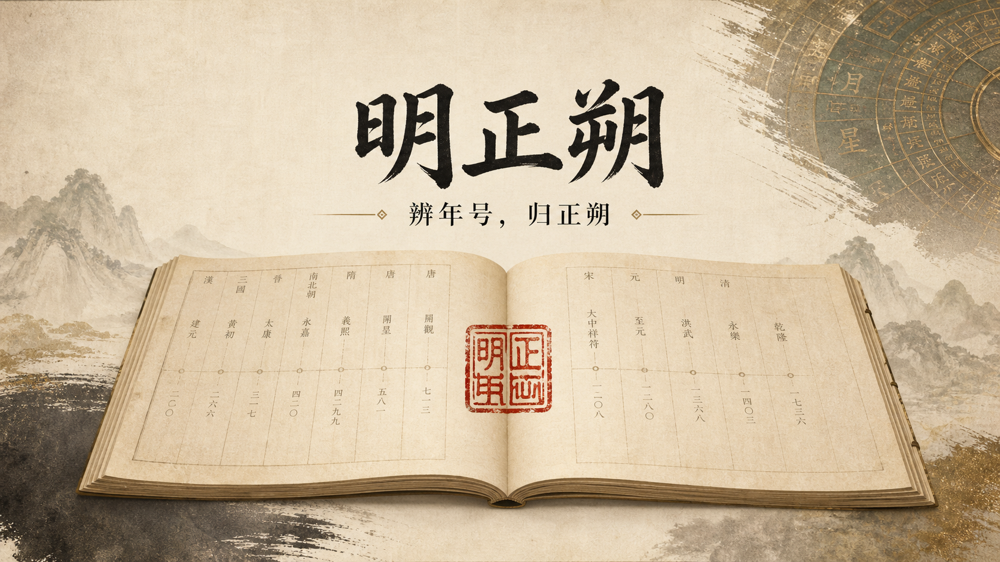

<div align="center">
  
  <h1>明正朔</h1>
  <p><strong>辨年号，归正朔。</strong></p>
  <p>东亚历史年号转换与正统纪年工具</p>
  <p><a href="https://siyuan-chat.github.io/ming-zhengshuo/"><strong>打开在线工具</strong></a></p>
</div>



## 项目简介

明正朔用于将东亚历史纪年转换为公元年份，并依据项目默认的正统线输出对应纪年。当前支持清朝、日本近现代、朝鲜与大韩帝国年号，也收录两晋南北朝、五胡十六国、辽金元、南明等历史纪年样例。

月日部分暂不换算，按输入原样保留。项目明确展示所采用的规则边界，不宣称排除其他史观。

```text
清同治五年三月初八 = 公元1866年 = 大明永历二百二十年三月初八
```

## 使用方式

### 网页

访问 [GitHub Pages 在线版](https://siyuan-chat.github.io/ming-zhengshuo/)。网页转换在浏览器本地完成，不需要登录。

本地开发：

```bash
pnpm install
pnpm dev
```

### 命令行

```bash
python -m pip install -e .
ming-zhengshuo "日本昭和二十年八月十五"
```

不安装命令时，也可以在项目目录运行：

```powershell
$env:PYTHONPATH='src'
python -m ming_zhengshuo "同治五年三月初八"
```

## 测试

```bash
python -m unittest discover -s tests -v
pnpm test
pnpm build:pages
```

---

<div align="center">辨年号，归正朔。</div>
